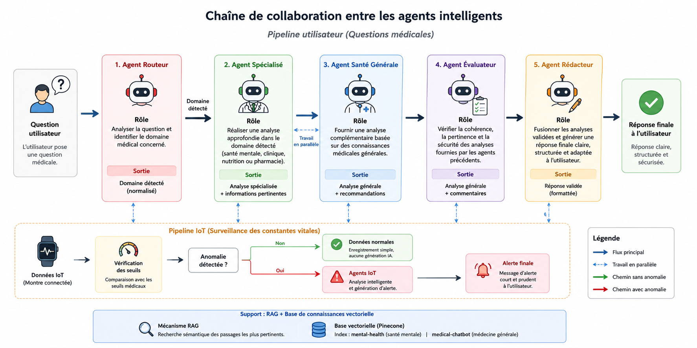

# 🩺 Système Multi-Agents de Suivi de Santé

> **Projet de Fin d'Année (PFA) | ENSIAS — Génie Logiciel | 2025-2026**

> Réalisé par : **REZGUANI Hiba** & **BAHBAH Ikram**

---

## Présentation

Le **Système Multi-Agents de Suivi de Santé** est une plateforme intelligente combinant **Intelligence Artificielle**, **Architecture Multi-Agents**, **Retrieval-Augmented Generation (RAG)** et **Internet des Objets (IoT)** afin d'assister les utilisateurs dans leurs questions médicales et d'assurer une surveillance automatique de leurs constantes vitales.

Le système repose sur deux scénarios principaux :

- **Assistant médical intelligent** capable de répondre aux questions relatives à la santé.
- **Surveillance IoT** permettant d'analyser les données physiologiques provenant d'une montre connectée et de générer des alertes en cas d'anomalie.

---

## Fonctionnalités

### Assistant médical intelligent

- Analyse des questions médicales.
- Routage automatique vers l’agent spécialisé approprié.
- Génération de réponses enrichies par le mécanisme RAG.
- Historique des conversations.
- Validation et reformulation automatique des réponses.

### Surveillance IoT

- Réception des données d'une montre connectée.
- Surveillance de la fréquence cardiaque.
- Surveillance de la saturation en oxygène (SpO₂).
- Surveillance de la température corporelle.
- Surveillance de la pression artérielle.
- Détection automatique des anomalies.
- Génération d'alertes médicales.

### Gestion des utilisateurs

- Inscription et authentification.
- Réinitialisation du mot de passe par email.
- Gestion des sessions utilisateur.

---

## Architecture Multi-Agents

Le système repose sur plusieurs agents spécialisés collaborant pour analyser les requêtes médicales et les données physiologiques.

### Agents impliqués

| Agent | Rôle |
|---------|---------|
| Reader & Router Agent | Identification du domaine médical concerné |
| General Health Agent | Analyse médicale générale |
| Mental Health Agent | Analyse des questions liées à la santé mentale |
| Nutrition Agent | Analyse des questions nutritionnelles |
| Pharmacy Agent | Analyse des médicaments et traitements |
| Clinical Agent | Analyse clinique spécialisée |
| Monitoring Agent | Surveillance des constantes vitales |
| Evaluator Agent | Validation et contrôle qualité |
| Writer Agent | Génération de la réponse finale |
| Manager Agent | Gestion des cas complexes et reprise sur erreur |

### Chaîne de collaboration entre les agents

  

---
### Description du pipeline

Lorsqu’un utilisateur pose une question médicale, l’**Agent Routeur** analyse la requête afin d’identifier le domaine concerné : santé mentale, clinique, nutrition ou pharmacie. Ensuite, deux traitements sont lancés : l’**Agent Spécialisé** produit une analyse approfondie selon le domaine détecté, tandis que l’**Agent Santé Générale** fournit une analyse complémentaire basée sur des connaissances médicales générales.

Les réponses générées sont ensuite transmises à l’**Agent Évaluateur**, qui vérifie leur cohérence, leur pertinence et leur sécurité. Si les résultats sont satisfaisants, l’**Agent Rédacteur** fusionne les analyses validées et génère une réponse finale claire, structurée et adaptée à l’utilisateur.

Pour le pipeline IoT, les données provenant de la montre connectée sont d’abord comparées aux seuils médicaux définis. Si les constantes vitales sont normales, elles sont simplement enregistrées sans génération d’alerte. En cas d’anomalie, les agents IoT réalisent une analyse intelligente des mesures et produisent une alerte médicale courte et compréhensible destinée à l’utilisateur.

## Mécanisme RAG

Afin d'améliorer la pertinence des réponses médicales, le système utilise une approche **Retrieval-Augmented Generation (RAG)** basée sur **Pinecone**.

### Index vectoriel : mental-health

**Sources documentaires :**

- *Cognitive Behavioural Therapy (CBT) Skills Workbook*
- *The Cognitive Behavioral Workbook for Anxiety* — William J. Knaus
- *Depression* — National Institute of Mental Health (NIMH)
  
### Index vectoriel : medical-chatbot

**Source documentaire :**

- *The Gale Encyclopedia of Medicine*

### Paramètres d'indexation

| Paramètre | mental-health | medical-chatbot |
|---|---|---|
| Modèle d'embedding | `all-MiniLM-L6-v2` (384 dimensions) | `all-MiniLM-L6-v2` (384 dimensions) |
| Métrique de similarité | Cosinus | Cosinus |
| Infrastructure | Serverless – AWS us-east-1 | Serverless – AWS us-east-1 |
| Taille des chunks | 500 caractères | 500 caractères |
| Chevauchement | 50 caractères | 50 caractères |
| Agent associé | Mental Health Agent | General Health Agent |

---

## Technologies Utilisées

| Catégorie | Technologies |
|------------|-------------|
| Frontend | React.js, Tailwind CSS, JavaScript |
| Backend | Python, FastAPI, SQLite |
| Intelligence Artificielle | CrewAI, LangChain, OpenAI GPT-4o-mini, RAG |
| Base vectorielle | Pinecone, all-MiniLM-L6-v2 |
| IoT | SmartWatch Simulator, API REST |
| Services externes | GitHub Models, Brevo SMTP |
| Outils de développement | Git, GitHub, Visual Studio Code |

---

